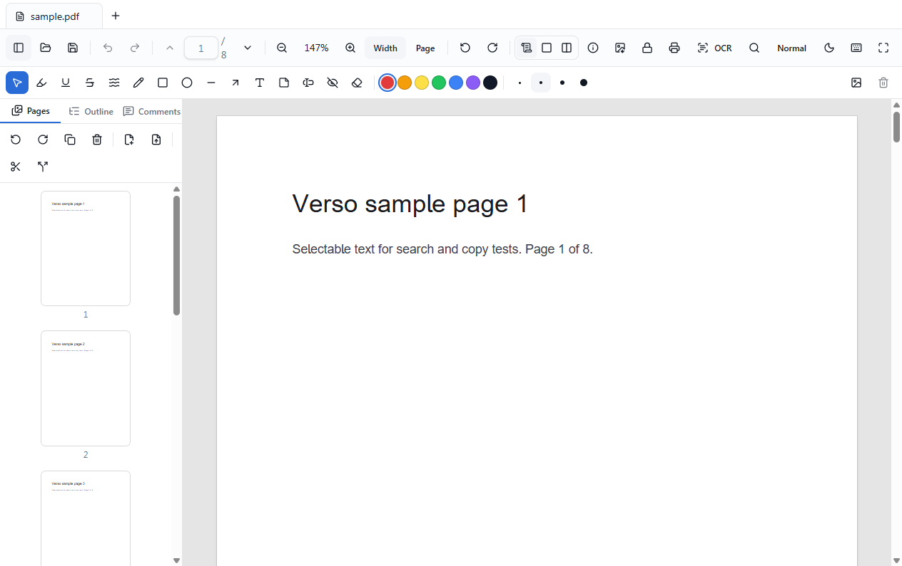

<div align="center">

# Verso

**A fast, private, open-source PDF viewer & editor for the desktop.**

Read beautifully. Mark up, reorganize, fill, OCR, and edit — all on your
machine, with no account, no telemetry, and no cloud.

[](https://github.com/soldforaloss/verso/actions/workflows/ci.yml)
[](./LICENSE)
[](#install)
[](https://www.electronjs.org/)

[versoeditor.com](https://versoeditor.com)

</div>



## Why Verso?

PDF tools are either expensive subscriptions or web apps that upload your
documents to someone else's server. Verso is neither:

- **Private by design.** Everything happens locally. No telemetry, no analytics,
  no network calls — the only optional connection is a user-controlled update
  check. Works fully offline.
- **Fast & calm.** A desktop-native feel, not a web page in a window. Page
  virtualization keeps large documents smooth; the UI stays out of your way.
- **Genuinely free & open.** MIT-licensed, with a clean, permissively-licensed
  dependency stack (no AGPL contamination).
- **Keyboard-friendly & accessible.** Everything reachable by keyboard; built on
  accessible Radix primitives with light/dark and reading themes.

## Features

Status reflects what's on `main`.

| Area       | Capability                                                                                                                                                                     |
| ---------- | ------------------------------------------------------------------------------------------------------------------------------------------------------------------------------ |
| Viewer     | PDF.js rendering (+ optional Tier-3 PDFium WASM engine), text selection, zoom, layouts, themes, tabs                                                                           |
| Navigation | Thumbnails, editable outline/bookmarks, full-text search (match-case / whole-word)                                                                                             |
| Pages      | Reorder, rotate, delete, insert, extract, merge, split, crop — all undo/redo                                                                                                   |
| Annotation | Highlight/underline/strike/squiggly, ink, shapes, text boxes, sticky notes, stamps, signatures                                                                                 |
| Forms      | **Fill _and author_** AcroForms — text, checkbox, dropdown, list, radio; with required / read-only / multiline / max-length / default value                                    |
| Links      | Author clickable hyperlinks — external URLs (sanitized) and internal page jumps                                                                                                |
| Editing    | **True in-place text editing** — retype _and restyle_ (size, bold, italic, colour, font) real content-stream text (PDFium); add text, images, shapes; cover-&-replace fallback |
| Stamping   | Watermarks, running page numbers ("Page N of M"), and **Bates numbering** (prefix + zero-padded sequence) across pages                                                         |
| OCR        | Make scanned PDFs searchable — tesseract.js, 8 bundled languages, fully offline                                                                                                |
| Compare    | Side-by-side visual (pixel) diff and word-level text diff between two PDFs                                                                                                     |
| Sign       | **Cryptographic digital signatures** — sign with your certificate (.p12/.pfx); a real PKCS#7 signature readers validate, plus visual draw/type signatures                      |
| Security   | Encrypt/decrypt, permissions, repair, linearize, **true redaction**, PNG/JPEG export                                                                                           |
| Robustness | Auto-decrypts owner-restricted PDFs and auto-repairs damaged ones on open                                                                                                      |
| Platforms  | Windows, macOS, and Linux — the full test suite runs on all three in CI                                                                                                        |

See [`ROADMAP.md`](./ROADMAP.md) for the full plan. The main remaining stretch
goal is code-signed installers.

## Install

Download for your platform from the
[**Releases**](https://github.com/soldforaloss/verso/releases) page:

| Platform    | Download                                                                 |
| ----------- | ------------------------------------------------------------------------ |
| **Windows** | `Verso-<version>-x64-setup.exe` (installer) or `-x64-portable.exe`       |
| **macOS**   | `Verso-<version>-arm64.dmg` (Apple Silicon) or the `-mac.zip`            |
| **Linux**   | `Verso-<version>.AppImage` (run anywhere) or `verso_<version>_amd64.deb` |

> **Unsigned for now.** The installers aren't yet code-signed, so the OS shows a
> first-run warning. It's safe to proceed:
>
> - **Windows** — SmartScreen: _More info → Run anyway_.
> - **macOS** — right-click the app → _Open_ (or _System Settings → Privacy &
>   Security → Open Anyway_). Apple Silicon only for now.
> - **Linux** — `chmod +x Verso-*.AppImage` then run it.

### Build from source

```bash
# Requires Node.js >= 20.19 (22 LTS recommended) and Git.
git clone https://github.com/soldforaloss/verso.git
cd verso
npm install
npm run fetch:qpdf  # download the qpdf security sidecar into resources/bin (optional)

npm run dev         # launch in development with HMR
npm run build       # typecheck + production build into out/
npm run build:win   # Windows installer + portable exe in release/
npm run build:mac   # macOS .dmg / .zip
npm run build:linux # Linux AppImage / .deb
```

> The security features (encrypt/decrypt/repair/linearize) use a bundled
> [qpdf](https://github.com/qpdf/qpdf) sidecar. `npm run fetch:qpdf` downloads it
> (not committed); on macOS install it with `brew install qpdf`. Without it,
> those features show as unavailable and everything else works normally.

## Tech stack

Electron · electron-vite · React 19 + TypeScript (strict) · Vite 7 · Tailwind
CSS v4 + Radix/shadcn-style primitives · Zustand + Immer · zod · PDF.js + an
optional PDFium WASM engine (rendering) · pdf-lib (mutation) · tesseract.js
(OCR) · qpdf sidecar (security) · Vitest + React Testing Library + Playwright ·
electron-builder + electron-updater.

Exact versions and the rationale behind them live in
[`docs/decisions/`](./docs/decisions).

## Architecture & security

Verso runs the renderer as fully untrusted: `contextIsolation` + `sandbox` on,
`nodeIntegration` off, a strict CSP, and a single minimal, **zod-validated**
`contextBridge` API. The full process diagram and the security checklist are in
[`docs/architecture.md`](./docs/architecture.md).

## Contributing

Contributions are welcome! Start with [`CONTRIBUTING.md`](./CONTRIBUTING.md) for
dev setup, conventions (Conventional Commits), and how to add an ADR. Please also
read the [Code of Conduct](./CODE_OF_CONDUCT.md). To report a security issue, see
[`SECURITY.md`](./SECURITY.md).

## License

[MIT](./LICENSE) © Verso contributors. Third-party licenses are tracked in
[`THIRD_PARTY_NOTICES.md`](./THIRD_PARTY_NOTICES.md).
